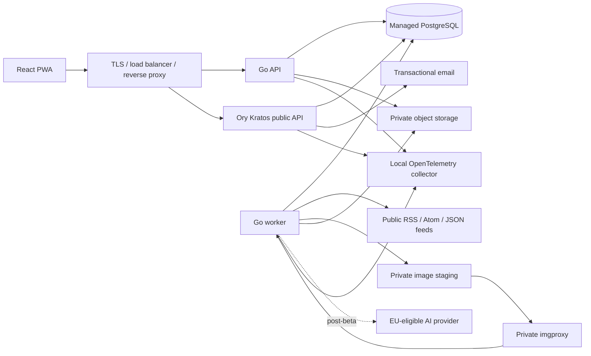

# Architecture

This document describes the target architecture for the RSS reader (working title). The system is an
open-source, privacy-conscious web application optimized for fast, keyboard-driven feed triage. It
is a modular monolith: one repository, one primary PostgreSQL database, and a small number of
independently runnable processes.

## System overview

The browser uses one origin: `/` serves the PWA, `/api/*` routes to Go, and `/.ory/kratos/*` exposes
only Kratos browser endpoints. Administrative identity endpoints remain private. Authentication uses
secure HTTP-only cookies; tokens are never stored in browser storage.

## Application components

**Web client.** A client-rendered React and strict-TypeScript PWA built with Vite, TanStack Router,
and TanStack Query. Typed URL state covers folders, filters, sorting, and selected articles. The
OpenAPI contract generates the browser client. The service worker caches only the application shell;
feed data requires a network connection.

**Go backend.** A modular Go application exposes subcommands for `api`, continuous `worker`, bounded
`worker --once`, and explicit migrations. It uses the standard HTTP router, OpenAPI-generated strict
interfaces, `pgx` with `sqlc`, Goose migrations, and River jobs. API and job handlers are idempotent
and safe under duplicate execution.

**Feed ingestion.** A shared canonical feed is fetched once for all subscribers, while subscription,
folder, read, and star state remain private per account. Adaptive polling targets 30-minute
freshness for active feeds and backs off slow or failing origins. A single hardened fetcher handles
discovery, feeds, and images: HTTP(S) ports 80/443 only, public addresses only, redirect
revalidation, strict time and size limits, conditional requests, rate limits, an identifiable user
agent, and RFC 9309 behavior.

**Storage and search.** PostgreSQL stores identities in a separate Kratos database/role and
application data in the application database. PostgreSQL full-text search uses a generated
`tsvector` and GIN index over sanitized feed-supplied text. Unstarred articles are retained for 180
days; starred items remain until unstarred or the account is deleted. OPML imports and maintenance
work run asynchronously through River.

**Images.** The Go worker validates and temporarily stages accepted JPEG, PNG, GIF, or WebP input. A
private, pinned `imgproxy` instance produces one static WebP derivative; Go validates the result and
writes it content-addressed to private object storage. The API authorizes opaque image references
and issues short-lived download URLs. Originals are deleted immediately, with a one-day staging
lifecycle failsafe. Rights-management fields are preserved separately; sensitive camera and location
metadata is removed.

**Identity and optional AI.** Self-hosted Ory Kratos provides invite-only passwordless email-code
authentication. Kratos HTTP may run on both production VMs, but exactly one courier process sends
email. Manual folder digests are post-beta, stateless, schema-validated, citation-checked, capped by
an application budget, and enabled only with an eligible EU-processing provider.

## Deployment and operations

Yandex Cloud is used only for internal development: serverless API and bounded worker invocations,
managed PostgreSQL, and one Podman VM for Kratos and `imgproxy`. No external user data enters this
environment.

Before external beta, the same OCI images move to two EU-region VMs in separate failure domains.
Production uses rootless Podman Quadlet units, a managed load balancer, multi-zone managed
PostgreSQL with PITR, private object storage, and a managed secret store. Patroni is an optional lab
exercise, not the production database plan.

Terraform provisions infrastructure and secret references; minimal cloud-init bootstraps hosts;
Ansible configures them. CI builds signed images tagged by commit, runs explicit expand/contract
migrations, and rolls out one VM at a time with readiness checks and automatic image rollback.
OpenTelemetry collectors redact and sample telemetry before export. Detailed logs contain no feed
URLs, article content, searches, credentials, or user email addresses.

Production targets 99.5% availability without a contractual SLA, less than five minutes of potential
account-state loss, and restoration within four hours. Backups are verified monthly and restored
quarterly. Cloud, email, telemetry, and AI vendors remain gated on legal ownership, eligibility, EU
hosting/transfer terms, retention, pricing, and proof tests.
