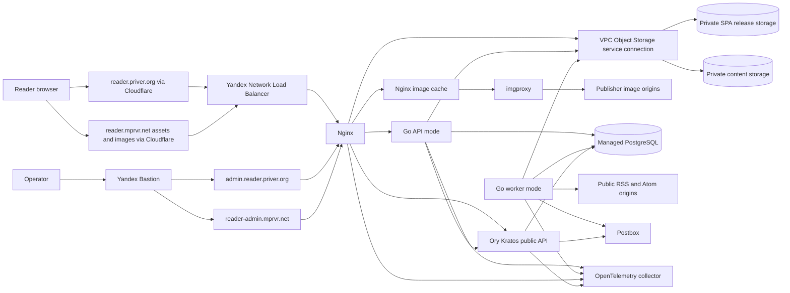

# Architecture

This document defines the confirmed target architecture through invitation beta.

## System topology



## Current and target layout

Confirmed target layout:

```text
apps/
  web/                End-user React SPA
  admin/              Private operator React SPA
services/
  backend/            Go modular monolith with API and worker modes
packages/
  api-client/         Generated TypeScript OpenAPI types and fetch client
contracts/
  openapi.yaml        Design-first browser API contract
deploy/
  compose.yaml        Podman and Docker compatible service definition
  nginx/              App, static-origin, private admin, and image-cache routing
  kratos/             Identity schemas and self-service flow configuration
  imgproxy/           Presets and hardened runtime configuration
infra/
  opentofu/           Yandex Cloud, Cloudflare, release buckets, and production resources
docs/                 Product, architecture, operations, and decisions
justfile              Human entry point for cross-language tasks
```

Why these names:

- `apps/web` identifies the primary browser product without repeating the repository name.
- `apps/admin` names its operator audience and remains distinct from the public app.
- `services/backend` avoids implying the Go binary is only an API; the same codebase also runs
  scheduling and ingestion workers.
- `contracts` owns source contracts; `packages/api-client` owns generated TypeScript artifacts.
- JavaScript and TypeScript workspaces retain the personal `@priver/*` package namespace.
- Do not create a shared UI package until real duplication between the two apps justifies it.

## Local development

Run the browser apps, the Go API process, and the worker process natively for fast reloads. The root
Compose stack provides disposable PostgreSQL, Kratos, S3-compatible Object Storage, Mailpit,
imgproxy, Nginx, and OpenTelemetry collector dependencies. Local development does not require Yandex
Cloud services.

## Frontend

Both browser apps use:

- React 19
- Vite 8
- TypeScript 7
- TanStack Router
- TanStack Query for server state
- TanStack Form for application forms
- TanStack Virtual for long article lists
- Tailwind CSS 4
- shadcn `base-nova` source components on Base UI
- React Compiler

The end-user SPA is static. Its document remains at `reader.priver.org`, where Nginx reads the exact
`/releases/<release-id>/index.html` object selected by the VM deployment manifest. The document
loads content-addressed JS, CSS, fonts, icons, and other public build assets from the cookieless
`reader.mprvr.net` origin. It receives application data through same-origin REST/JSON `/api`
requests and renders Ory Kratos browser flows under same-origin `/auth` routes.

Asset URLs do not include a release ID. Both browser builds publish immutable
`/assets/<content-hash>.<ext>` keys so an unchanged chunk keeps the same browser-cache entry across
releases. Each release has a manifest that lists its asset keys. Cleanup uses retained manifests
rather than object age alone because a current release may still reference an old object.

In production, Nginx reads release HTML and assets directly through a VPC Object Storage service
connection. Release-bucket policies permit unsigned `GET` and `HEAD` requests only through that
private endpoint and only for the required object prefixes. Nginx holds no Object Storage
credentials. The API and worker use authenticated, process-scoped content access through the same
service connection.

Use router search state, component state, and small React contexts for browser-owned state. A global
state store is not part of the target.

The admin SPA is a separate build at `admin.reader.priver.org`. Operators can reach its document,
API, and authentication routes only through Yandex Bastion and must have a passkey-authenticated
admin session. Its private Nginx vhost proxies `/api` and `/auth` so browser traffic remains
same-origin. The document loads its content-addressed build assets from the separate cookieless
`reader-admin.mprvr.net` origin. That hostname uses the same private DNS, TLS, Nginx listener, and
Bastion access path as the admin application; Cloudflare does not proxy it.

## Backend

`services/backend` is one Go 1.26 module and one modular-monolith codebase. Build distinct API and
worker process modes from it. Each mode can scale and restart independently while sharing domain
packages.

Core dependencies:

- Standard-library `net/http`
- Strict `oapi-codegen` standard HTTP server
- `pgx` and `sqlc`
- Goose transactional SQL migrations embedded in the backend binary
- River PostgreSQL jobs
- `gofeed` for RSS and Atom parsing
- `golang.org/x/net/html` for feed HTML normalization
- Bluemonday for final HTML sanitization
- Standard `log/slog` and OpenTelemetry instrumentation

The OpenAPI file is the design-first REST/JSON contract. Generate strict Go server interfaces and a
small TypeScript `openapi-fetch` client. Commit generated output and configure CI to fail on
generation drift. Application migrations run in transactions by default. Any nontransactional
exception requires explicit review and documentation.

## Service responsibilities

### End-user SPA

- Present the public email-only invitation request form before registration.
- Present subscriptions, folders, filters, article lists, and reader state.
- Apply optimistic read, save, progress, and bulk-state mutations.
- Refetch lightweight counts periodically and when the window regains focus.
- Render only sanitized body HTML returned by the API.
- Do not build publisher URLs or imgproxy signatures in the browser.
- Send no credentials to `reader.mprvr.net` for build assets or images.

### Admin SPA

- Review invitation requests and manage invitations and application roles.
- Inspect users, feeds, refresh attempts, River queues, retention, and failures.
- Record every mutation through audited backend operations.
- Expose no direct database or Kratos admin credentials to the browser.
- Keep secrets out of the bundle and send no credentials to `reader-admin.mprvr.net`.

### API mode

- Accept bounded public invitation requests without disclosing account or request status.
- Validate Kratos sessions directly in middleware.
- Enforce user ownership and admin authorization.
- Approve or reject invitation requests and issue direct invitations through audited admin
  operations.
- Serve cursor-paginated article lists and title/source search.
- Mutate subscription, folder, read, saved, and progress state.
- Convert internal content envelopes into browser-safe article DTOs.
- Maintain a 128 MiB LRU for decompressed content envelopes.
- Expand app-owned image placeholders into current HMAC-signed `reader.mprvr.net/images/` paths when
  serving content.
- Generate signed thumbnail candidates from the entry lead-image projection in list DTOs.

### Worker mode

- Discover, canonicalize, and validate public RSS and Atom feed endpoints.
- Schedule feed refresh from publication and failure history.
- Fetch feeds with conditional HTTP and publisher-level concurrency limits.
- Parse and normalize entries.
- Sanitize feed-provided article bodies and store app-owned image placeholders plus an image
  manifest.
- Commit a PostgreSQL publication intent before uploading each immutable content envelope.
- Read back and fully verify an uploaded envelope before atomically publishing its metadata and
  current-object reference.
- Recover fenced publication attempts and remove only PostgreSQL-declared orphans after their
  recovery windows.
- Deliver invitation email jobs through Postbox.
- Run retention, orphan cleanup, and OPML import and export jobs.

### Ory Kratos

- Own identities, credentials, browser sessions, verification, recovery, and social login.
- Deliver email codes through Yandex Cloud Postbox.
- Keep identity tables in a dedicated PostgreSQL database and role.

### imgproxy

- Fetch public publisher images on demand from signed requests.
- Enforce fixed presets, source limits, and network restrictions.
- Produce explicit AVIF and WebP responsive variants.
- Remain private behind Nginx with no direct public port.

## Implementation sequence

Build the target in end-to-end vertical slices. Do not complete frontend, backend, or infrastructure
layers in isolation. The first slice follows the production architecture. It lets one user sign in,
add one public feed, and fetch it through the scheduler. It persists and serves one article, renders
that article safely, and marks it read. The slice includes its migrations, generated API contract,
local dependencies, tests, telemetry, object-backed browser release, and deployment path.

Extend that slice through the personal-alpha checklist before adding admin and growth work.
Implement folders, saving, progress, OPML import and export, search, and operational controls as
usable end-to-end paths. Test each path through every component it touches.

## Feed endpoint lifecycle

1. The server bounds and canonicalizes a direct feed URL, OPML feed URL, or website URL before
   endpoint lookup.
2. A normalized canonical endpoint or permanent alias already owned by a Feed reuses that Feed.
3. The worker uses the shared safe HTTP client for direct feed fetches and website discovery.
4. The client validates and pins public DNS answers and reruns URL and address checks on each of at
   most five redirects.
5. A leading `301` or `308` chain updates the canonical endpoint and records prior permanent
   endpoints as aliases. Temporary redirect targets remain request-local.
6. If a permanent target belongs to another Feed, an idempotent merge converges on that target Feed
   before ingestion continues.
7. Payload, entries, titles, site URLs, Atom `rel=self`, DNS aliases, and temporary redirects never
   merge Feeds.

A merge first fences both Feeds in stable ID order. New publication, import finalization, and bulk
watermark snapshots then defer while existing undo contexts reach a terminal state. The final
transaction locks Feeds before Entries, reconciles observation positions and read state, and fences
affected refreshes and publication intents.

The complete path and query are public endpoint identity. The exact normalization and capability-URL
limits live in [`0007-feed-url-policy.md`](decisions/0007-feed-url-policy.md).

## Feed refresh lifecycle

1. A scheduler selects due feeds from persisted `next_fetch_at` values.
2. River receives a unique feed-refresh job.
3. The worker claims a persisted feed-refresh generation, then fetches the canonical endpoint with
   conditional headers, redirect reconciliation, and safe-network checks.
4. The worker parses RSS or Atom and resolves versioned feed-scoped entry keys.
5. The worker normalizes and sanitizes candidates, groups duplicate keys with the deterministic
   representation rule, and selects one candidate per key. An unchanged digest is a no-op; a changed
   digest receives the next content version.
6. In PostgreSQL, the worker locks the Entry and commits a fenced publication intent with an opaque,
   immutable object key, the current compare-and-swap base, proposed metadata, and expected digests.
   A new Entry shell remains hidden until publication.
7. After that commit, the lease holder conditionally uploads the deterministic gzip bytes directly
   to the final key. It resolves ambiguous writes by reading the key rather than overwriting it.
8. The worker performs a full read-back through the private endpoint. It verifies the compressed
   length and SHA-256, strictly decodes and integrity-checks the envelope, and reconstructs the
   representation digest from the body and proposed metadata. HEAD or ETag success is insufficient.
9. One PostgreSQL transaction checks the publication and feed-generation fences and confirms that
   the Entry still matches the intent's base. For a new Entry it first locks the Feed and assigns
   the next observation position. It then publishes all metadata, the content version, and the
   current-object reference together and marks the prior object orphaned. This commit is the only
   point at which the new representation becomes visible.
10. A retry before upload regenerates the same object or abandons the fenced intent. A retry after
    upload repeats read-back verification. A retry after an ambiguous publication commit reads the
    current PostgreSQL reference and treats an exact match as success. A stale base or generation
    can only orphan its unique object.
11. Orphan cleanup waits the PostgreSQL recovery deadline, then moves an unreferenced object into a
    deletion outbox in a transaction protected by the current-reference foreign key. Only afterward
    does it check current-key state: a never-uploaded key completes without a marker, while an
    expected data version receives one marker and remains recoverable by exact version.
12. The worker records outcome, latency, validators, and publication history. The scheduler derives
    the next interval from publication cadence and bounds it by freshness and backoff rules.

Manual refresh enqueues the same unique work. It never creates a second fetch for a feed already in
progress. River uniqueness reduces duplicate work; the persisted generation and publication fences
provide correctness after lease expiry.

The complete staging, retry, timing, and deletion protocol lives in
[`0009-content-object-publication.md`](decisions/0009-content-object-publication.md).

## OPML import lifecycle

1. The API bounds and safely parses the uploaded XML before enqueueing network work. A structural
   failure creates no import plan and no user data.
2. After per-user rate and active-run checks, an accepted run persists an immutable, source-ordered
   candidate plan and returns its import ID.
3. Workers canonicalize candidates and resolve them through the normal safe feed endpoint lifecycle.
   Permanent item failures stop immediately; transient failures receive at most five total attempts
   within 24 hours.
4. Once every candidate is resolved or terminal, the worker groups successful occurrences by final
   Feed identity and chooses each Feed's earliest successful source occurrence. Completion order
   does not select its folder.
5. One finalization transaction preserves existing subscriptions and processes new Feed groups in
   source order. Invalid folder names do not consume capacity; valid groups consume the remaining
   slots, create only referenced flattened folders, and receive initial read watermarks.
6. A finalization retry uses the import ID and persisted result to resolve an ambiguous commit. It
   cannot create duplicate subscriptions, folders, or initial state.
7. The API exposes separate occurrence and final Feed-group outcome counts plus at most 100
   source-ordered item errors. Successful candidates remain imported when other candidates fail.

Exact path, duplicate, capacity, and read-boundary behavior lives in
[`data-model.md`](data-model.md#opml-path-flattening); parser limits live in
[`security.md`](security.md#opml-import).

## Article read lifecycle

1. The SPA selects an article from a cursor-paginated list.
2. The SPA applies the read mutation optimistically, and the API persists it as sparse state.
3. The API resolves the current content object key.
4. The API serves a hot LRU entry or loads, boundedly decompresses, schema-validates, and
   integrity-checks the Object Storage envelope.
5. The API validates typed image placeholders against the manifest, then expands them into signed
   URLs using the current imgproxy key.
6. The API returns a browser-safe DTO without the internal image manifest.
7. The DTO ETag covers content version, rendering-schema version, image-preset version, and
   signing-key generation. Any output-affecting change forces a fresh representation.
8. The browser renders sanitized HTML under strict CSP and Trusted Types policy.
9. Reader throttles and synchronizes coarse reading progress.

The application never downloads the linked publisher page through beta. A truncated feed exposes an
open-original action.

## Image lifecycle

1. Feed HTML normalization resolves each public image URL against the entry base URL and stores an
   app-owned placeholder plus manifest entry.
2. The API emits current signed `reader.mprvr.net/images/` URLs for fixed responsive presets and
   explicit formats.
3. The browser selects an AVIF or WebP candidate through `<picture>` and `srcset`.
4. Cloudflare serves an edge hit or forwards to the stable Yandex origin.
5. Nginx serves its file-cache hit or locks one fill request to imgproxy.
6. imgproxy validates the signature, preset, source address, redirects, size, and resolution.
7. Cloudflare and Nginx cache successful output under its immutable content-versioned path.

Detailed visual design sets exact responsive widths. The architecture requires a small fixed set and
does not allow arbitrary client-selected dimensions.

## Authentication lifecycle

1. The SPA starts a Kratos browser flow under `/auth`.
2. Kratos emails a one-time code through Postbox.
3. Kratos establishes a secure browser session after code verification.
4. The user enrolls one or more passkeys from authenticated settings.
5. Passkeys become the preferred login method. Email code remains recovery access.
6. The Go API validates the Kratos session and maps its identity ID to an application user.

During beta, users can link Google only from settings. Reader does not link accounts by matching
email addresses.

## Invitation lifecycle

1. An unauthenticated visitor submits one email address through the public Reader form.
2. The API validates and rate-limits the submission, records at most one pending request for that
   address, and returns the same response whether an account, request, or invitation already exists.
3. A pending request expires 30 days after submission unless an administrator resolves it.
4. A passkey-authenticated administrator rejects the request or approves it. Administrators may also
   issue an invitation without a request.
5. Approval or direct issuance creates an email-bound, single-use invitation with seven-day expiry,
   appends the audit record, and enqueues its email in the same PostgreSQL transaction.
6. The worker sends the invitation through Postbox and retries transient delivery failures through
   River.
7. Reader validates the invitation before registration completes and binds redemption to the invited
   email address.

Submitting a request creates no credential and grants no access. Kratos continues to own the
identity, credentials, and browser session after registration.

## Scheduling terms

Recent publication history determines whether a feed is high-frequency and qualifies for the minimum
polling interval. The scheduler sets its next successful-check target no later than 30 minutes after
the previous successful check unless `Retry-After`, publisher throttling, or failure backoff
applies.

Low-frequency feeds receive longer intervals derived from publication history. Exact classification
thresholds are an implementation decision covered by deterministic scheduler tests.

The freshness SLO requires 95% of eligible high-frequency feeds to complete a successful check
within 45 minutes of their previous successful check. Monitor due-job lag separately so a permissive
schedule cannot hide scheduler delay.

## Scale and quality targets

- 1,000 users
- 100 average subscriptions per user
- 500 hard subscriptions per user
- 25,000 unique public feeds
- 50 concurrent interactive clients
- 95% of eligible high-frequency feeds checked successfully within the 45-minute freshness SLO
- Cached interactive API p95 below 300 ms within `ru-central`

These are pre-beta design and load-test targets, not a promise of public-service capacity.

## Decision records

- [`0001-feed-content-policy.md`](decisions/0001-feed-content-policy.md)
- [`0002-identity.md`](decisions/0002-identity.md)
- [`0003-storage-model.md`](decisions/0003-storage-model.md)
- [`0004-image-delivery.md`](decisions/0004-image-delivery.md)
- [`0005-deployment-platform.md`](decisions/0005-deployment-platform.md)
- [`0006-static-spa-delivery.md`](decisions/0006-static-spa-delivery.md)
- [`0007-feed-url-policy.md`](decisions/0007-feed-url-policy.md)
- [`0008-entry-content-contracts.md`](decisions/0008-entry-content-contracts.md)
- [`0009-content-object-publication.md`](decisions/0009-content-object-publication.md)
