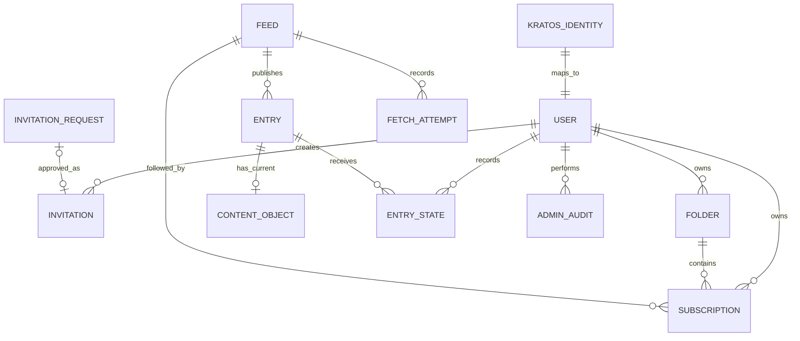

# Data model

This document defines the conceptual target model and invariants through invitation beta. It is not
a SQL schema. The first migrations and fixture corpus will determine exact columns, identifiers,
indexes, and entry-deduplication fallbacks.

## Storage boundaries

| Store                           | Owns                                                                                                                                   |
| ------------------------------- | -------------------------------------------------------------------------------------------------------------------------------------- |
| Application PostgreSQL database | Users, invitation requests, invitations, folders, feeds, subscriptions, entries, sparse user state, jobs, fetch history, audit records |
| Kratos PostgreSQL database      | Identities, credentials, sessions, verification, recovery, social login                                                                |
| Private content Object Storage  | Versioned compressed envelopes for sanitized feed bodies                                                                               |
| Private browser-release buckets | Versioned HTML, release manifests, and content-addressed browser assets                                                                |
| Nginx disk cache                | Rebuildable processed image responses; never authoritative data                                                                        |

Application and River tables share one database and transaction boundary. Kratos uses a distinct
database and role in the same initial managed cluster. Application code does not query Kratos tables
directly.

Browser releases are deployment artifacts, not application records or user data. Their 45-day
stale-document retention and reference-aware cleanup policy live in
[`deployment.md`](deployment.md#backups-and-recovery) and
[`0006-static-spa-delivery.md`](decisions/0006-static-spa-delivery.md).

## Ownership model

Public feed data is global. User choices and state are private.

The diagram is conceptual. `KRATOS_IDENTITY` is an external identity reference, not an application
table join.

## Entities

### User

Each application profile maps to one immutable Kratos identity ID.

Owns:

- Preferences and theme
- Folders and subscriptions
- Sparse article state
- Subscription export and deletion lifecycle
- Optional application roles

Email addresses and credentials remain Kratos-owned. Copy identity traits into application data only
when a product requirement needs them.

### Invitation request

An unauthenticated visitor submits one email address through the public form. The request grants no
access and contains no registration token or reusable credential.

Invariants:

- At most one pending request exists for an email address.
- A pending request expires 30 days after submission.
- Only an administrator may approve or reject a request.
- Approval creates a separate invitation; rejection and expiry cannot be redeemed.
- The public response does not reveal whether the email belongs to an account, request, or existing
  invitation.

The record contains the email address, request and expiry times, resolution status, and the optional
resulting invitation reference. Email comparison must use the same rules as identity registration.

### Invitation

An administrator creates a single-use registration invitation directly or by approving an invitation
request for one email address.

Invariants:

- Expires seven days after issuance.
- Stores no reusable login credential.
- Cannot be redeemed for a different email address.
- Records creator, optional source request, redemption, expiry, and revocation for audit.

### Folder

A user-owned named group. Each subscription belongs to at most one folder. OPML import maps outline
information into this flat model. The import design will define how to handle nested paths,
duplicate placements, and naming collisions.

### Feed

A globally shared public RSS or Atom source.

Owns:

- Canonical fetch URL, permanent endpoint aliases, and public site URL
- Display metadata
- HTTP validators
- Publication history
- Adaptive refresh schedule
- Health and failure state

The model stores no separate feed credentials or custom request headers through beta. The complete
canonical URL, including its path and query, is public endpoint identity. Signed, tokenized, and
otherwise confidential URLs are unsupported.

Endpoint invariants:

- Each normalized canonical URL or permanent alias has one global Feed owner.
- A leading chain of HTTP `301` and `308` responses may replace the canonical fetch URL. Preserve
  prior permanent endpoints as aliases so later submissions resolve to the same Feed.
- Temporary redirect targets never become aliases.
- If a permanent redirect reaches another Feed's endpoint, the target Feed survives an idempotent
  merge. Preserve source-only subscriptions and folder placement. When one user has both
  subscriptions, retain the target subscription.
- Do not merge Feeds by response content, parsed entries, title, public site URL, Atom `rel=self`,
  DNS alias, or temporary redirect target.

Entry collision behavior during a Feed merge follows the feed-scoped identity contract defined with
the first schema and fixture corpus. The URL contract lives in
[`0007-feed-url-policy.md`](decisions/0007-feed-url-policy.md).

### Subscription

A private user-to-feed relationship.

Owns:

- Folder placement
- Subscription creation time
- Initial read boundary
- Bulk read watermark

The hosted service accepts at most 500 active subscriptions per user.

### Entry

A feed-scoped, globally shared publication record.

Owns:

- Feed relationship
- Stable feed-scoped identity
- Publisher URL
- Title, author, publication time, and update time
- Validated lead-image source and content version for list-thumbnail projection
- Current content-object reference
- Content version

Publisher updates replace the current ordinary and saved representation. Reader does not expose
article revision history through beta.

Entry identity must prefer publisher-provided stable IDs and use deterministic feed-scoped
fallbacks. The exact fallback order remains an implementation decision backed by malformed and
real-world feed fixtures.

### Content object

Metadata for an object in private Object Storage.

The compressed, schema-versioned JSON envelope contains:

- Sanitized feed-provided HTML
- Plain text derived from the same sanitized body
- App-owned image placeholders and a normalized public image manifest
- Normalization metadata needed to render or migrate the envelope
- Content version and integrity hash

After successful processing, the worker discards source feed XML and unsanitized body HTML. Reader
does not fetch linked article pages. The API generates signed imgproxy URLs from the image manifest
at response time; they are not durable body data.

PostgreSQL never exposes a current content-object reference until the object is readable and passes
its integrity check. Retries are idempotent. Cleanup may remove staged or orphaned objects only
after the recovery window.

Article-list queries use the lead-image projection to generate signed thumbnails without loading
every body envelope. The projection follows the same image URL validation and content-version rules
as the manifest.

### Entry state

A sparse private user-to-entry record. Create this record only when its state differs from
subscription defaults or must survive independently.

Possible state:

- Explicitly read or unread exception
- Saved flag
- Coarse reading progress
- Last opened time

Avoid one row for every delivered user-entry pair.

### Fetch attempt

Records operational history for one feed request, including safe diagnostics such as outcome class,
duration, HTTP status, validators used, entries observed, and the next scheduling input. Logs and
tables must not become a second copy of feed bodies.

### Admin audit

An append-only record for every admin mutation.

Contains:

- Actor application user ID
- Action and target type
- Target ID
- Timestamp
- Request correlation ID
- Small allowlisted metadata without credentials, content, or secrets

## Read-state model

Unread state combines a per-subscription watermark with sparse entry exceptions.

### Subscribe or import

- Import currently available entries for browsing.
- Set the initial watermark so those entries begin read.
- Treat entries first observed after subscription as unread.

### Open

- Mark the entry read with a sparse exception when it is newer than the watermark.
- Keep the selected row in the current unread view until navigation leaves it.

### Mark unread

- Store an unread exception even when the entry lies behind the watermark.

### Mark scope read

- Advance the relevant subscription watermarks to the scope boundary.
- Remove sparse read exceptions made redundant by the new watermarks.
- Preserve saved and progress state.
- Keep enough mutation context for the product's temporary undo window.

Folder-wide and global mark-read operations update the member subscriptions rather than introducing
a second folder-level state model.

## Retention

| Data                     | Retention                                            |
| ------------------------ | ---------------------------------------------------- |
| Invitation request       | 30 days from submission                              |
| Ordinary sanitized body  | 90 days                                              |
| Ordinary entry metadata  | 90 days                                              |
| Saved body and metadata  | Until no user keeps the entry saved                  |
| Read/progress exceptions | While required by retained entries and product state |

Image-cache policy lives in [`security.md`](security.md). Backup and recovery policy lives in
[`deployment.md`](deployment.md).

Retention jobs run in bounded batches. Start with indexed unpartitioned entry tables and add native
partitioning only after measured query or cleanup behavior justifies it.

Retention removes ordinary metadata and its sanitized body together from the user's perspective. It
must not leave a bodyless ordinary entry visible through beta. Deleting expired ordinary content
must not remove an object still referenced by a saved item. Object Storage versioning provides a
short recovery window; lifecycle rules remove superseded or unreferenced versions after the recovery
period.

## Unsubscribe

When a user unsubscribes:

- Remove the subscription and ordinary private entry state for that feed.
- Preserve saved state and the metadata/content required to render saved items.
- Preserve the global feed and entries while other subscribers or retained saved items reference
  them.
- Garbage-collect globally orphaned data asynchronously after retention and recovery windows.

## Account deletion

Account deletion is immediate from the user's perspective.

Delete:

- Kratos identity and sessions
- Application user profile
- Invitations owned by or reserved for the user where policy permits
- Folders and subscriptions
- Private entry state and preferences
- User-identifying analytics links

Retain only globally shared public feed and entry records that have another valid reason to exist.
Admin audit data may retain the deleted actor's opaque ID without retaining identity traits.

## Export

Through beta, OPML export contains active subscriptions and folder structure using standard OPML
outlines. Reader does not export preferences, read state, saved items, reading progress, article
bodies, or image files.

## Open schema details

These details remain deferred to schema and fixture design:

- Primary-key representation
- Nested OPML flattening, naming collisions, and duplicate-feed placement
- Entry identity fallback order
- Exact content-envelope schema
- Exact idempotent protocol that publishes a content reference only after its object is readable
- Index selection and partition thresholds
- Audit retention duration
- Undo representation and expiry
