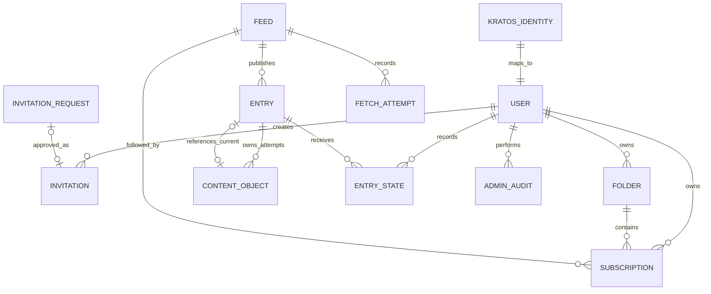

# Data model

This document defines the conceptual target model and invariants through invitation beta. It is not
a SQL schema. The first migrations and fixture corpus will determine exact columns, primary-key
representations, and indexes while preserving the versioned entry and content contracts below.

## Storage boundaries

| Store                           | Owns                                                                                                                                                                                                                      |
| ------------------------------- | ------------------------------------------------------------------------------------------------------------------------------------------------------------------------------------------------------------------------- |
| Application PostgreSQL database | Users, invitation requests, invitations, folders, feeds, subscriptions, entries, sparse user state, jobs, fetch history, audit records, content publication intents, references, deletion outbox, and recovery quarantine |
| Kratos PostgreSQL database      | Identities, credentials, sessions, verification, recovery, social login                                                                                                                                                   |
| Private content Object Storage  | Immutable versioned compressed envelopes, delete markers, and recoverable noncurrent versions                                                                                                                             |
| Private browser-release buckets | Versioned HTML, release manifests, and content-addressed browser assets                                                                                                                                                   |
| Nginx disk cache                | Rebuildable processed image responses; never authoritative data                                                                                                                                                           |

Application and River tables share one database and transaction boundary. Kratos uses a distinct
database and role in the same initial managed cluster. Application code does not query Kratos tables
directly. PostgreSQL alone decides whether an Entry and content-object reference are current or safe
to delete. Object Storage retains opaque bytes and version history but knows nothing about Entries,
saves, or retention eligibility.

Browser releases are deployment artifacts, not application records or user data. Their 45-day
stale-document retention and reference-aware cleanup policy live in
[`deployment.md`](deployment.md#backups-and-recovery) and
[`0006-static-spa-delivery.md`](decisions/0006-static-spa-delivery.md).

## Ownership model

Public feed data is global. User choices and state are private.

The diagram is conceptual. `KRATOS_IDENTITY` is an external identity reference, not an application
table join.

## Entities

### User

Each application profile maps to one immutable Kratos identity ID.

Owns:

- Preferences and theme
- Folders and subscriptions
- Sparse article state
- Subscription export and deletion lifecycle
- Optional application roles

Email addresses and credentials remain Kratos-owned. Copy identity traits into application data only
when a product requirement needs them.

### Invitation request

An unauthenticated visitor submits one email address through the public form. The request grants no
access and contains no registration token or reusable credential.

Invariants:

- At most one pending request exists for an email address.
- A pending request expires 30 days after submission.
- Only an administrator may approve or reject a request.
- Approval creates a separate invitation; rejection and expiry cannot be redeemed.
- The public response does not reveal whether the email belongs to an account, request, or existing
  invitation.

The record contains the email address, request and expiry times, resolution status, and the optional
resulting invitation reference. Email comparison must use the same rules as identity registration.

### Invitation

An administrator creates a single-use registration invitation directly or by approving an invitation
request for one email address.

Invariants:

- Expires seven days after issuance.
- Stores no reusable login credential.
- Cannot be redeemed for a different email address.
- Records creator, optional source request, redemption, expiry, and revocation for audit.

### Folder

A user-owned named group. Each subscription belongs to at most one folder. OPML import maps outline
information into this flat model. The import design will define how to handle nested paths,
duplicate placements, and naming collisions.

### Feed

A globally shared public RSS or Atom source.

Owns:

- Canonical fetch URL, permanent endpoint aliases, and public site URL
- Display metadata
- HTTP validators
- Publication history
- Adaptive refresh schedule
- Health and failure state

The model stores no separate feed credentials or custom request headers through beta. The complete
canonical URL, including its path and query, is public endpoint identity. Signed, tokenized, and
otherwise confidential URLs are unsupported.

Endpoint invariants:

- Each normalized canonical URL or permanent alias has one global Feed owner.
- A leading chain of HTTP `301` and `308` responses may replace the canonical fetch URL. Preserve
  prior permanent endpoints as aliases so later submissions resolve to the same Feed.
- Temporary redirect targets never become aliases.
- If a permanent redirect reaches another Feed's endpoint, the target Feed survives an idempotent
  merge. Preserve source-only subscriptions and folder placement. When one user has both
  subscriptions, retain the target subscription.
- Do not merge Feeds by response content, parsed entries, title, public site URL, Atom `rel=self`,
  DNS alias, or temporary redirect target.

Entry collision behavior during a Feed merge follows the feed-scoped identity contract below. The
URL contract lives in [`0007-feed-url-policy.md`](decisions/0007-feed-url-policy.md).

### Subscription

A private user-to-feed relationship.

Owns:

- Folder placement
- Subscription creation time
- Initial read boundary
- Bulk read watermark

The hosted service accepts at most 500 active subscriptions per user.

### Entry

A feed-scoped, globally shared publication record.

Owns:

- Feed relationship
- Stable feed-scoped identity
- Publisher URL
- Title, author, publication time, and update time
- Validated lead-image source for list-thumbnail projection
- Current content-object reference
- Content version
- Current normalized-representation digest

Publisher updates replace the current ordinary and saved representation. Reader does not expose
article revision history through beta.

#### Identity

Each Entry has an immutable versioned identity key unique within its Feed. Identity v1 uses the
first available source:

1. Opaque, case-sensitive RSS GUID or Atom ID after removal of surrounding XML whitespace
2. Canonical publisher link
3. Normalized title plus valid publication time
4. A source fingerprint over normalized title, authors, valid publication time, and selected
   feed-provided body

The stored form is `v1:<tier>:sha256:<lowercase-hex>`.
[ADR 0008](decisions/0008-entry-content-contracts.md) defines exact normalization, hash framing, and
fallback inputs. Reader rejects an item with no usable identity input. It never uses fetch time,
item position, or a random value.

A repeated key in one response is one candidate Entry. Reader chooses the greatest valid update
time, then greatest valid publication time, then the lexicographically smallest normalized
representation digest. Document order cannot change the winner. Different publisher IDs remain
different entries even when their links match; changing a publisher ID creates a new Entry.

When a permanent redirect merges Feeds, non-colliding Entries move to the target Feed. For an
identity collision, the target Entry ID survives and the same duplicate rule selects its current
representation. Retarget private Entry state and saved references. If one user has both state rows,
saved is true when either was saved, explicit unread wins over read, reading progress keeps the
furthest value, and last-opened time keeps the latest value.

#### Content version

Content version is a positive monotonic 64-bit integer. A new Entry starts at 1. For the same
identity, a changed durable representation increments it by exactly one; an unchanged normalized
representation keeps the current version and object. The digest covers publisher URL, normalized
title and authors, valid dates, body source kind, sanitized HTML, plain text, image manifest, and
lead-image projection. It excludes fetch and XML formatting, unknown fields, storage metadata, and
compression bytes.

Writers stop at the I-JSON exact-integer limit of 9,007,199,254,740,991 even though PostgreSQL uses
a signed 64-bit column.

Failed object publication does not make a proposed version current. A version proposed by an intent
is assigned only when PostgreSQL publishes it; abandoning the intent does not consume that number.
The next successful publisher change is therefore exactly current version plus one. Assigned
versions never decrement or repeat, including when a publisher restores earlier content. A pure
storage-schema or compression migration may preserve the version when browser output and lead image
remain identical. Any migration that changes durable publisher output increments it.

### Content object

PostgreSQL metadata for an immutable envelope in private Object Storage. One object belongs to one
Entry and one publication intent; Reader does not deduplicate objects between Entries. Its opaque
key is `content/objects/<random-object-id>.json.gz`. A retry of one intent reuses that key, while a
different intent always receives a new key. Keys never contain feed, Entry, user, or
proposed-version identity and are never reused after deletion.

Envelope v1 is RFC 8785 canonical I-JSON compressed with deterministic gzip level 6. The gzip header
has zero modification time, OS 255, and no name, comment, or extra fields. Objects use media type
`application/vnd.reader.content+json` and content encoding `gzip`.

Every field is required, including empty arrays and null values:

| Field                | Contract                                                                    |
| -------------------- | --------------------------------------------------------------------------- |
| `schema_version`     | Positive integer selecting the strict decoder; v1 is `1`                    |
| `content_version`    | Matches the current Entry content version                                   |
| `normalizer_version` | Version of deterministic HTML and metadata normalization                    |
| `sanitizer_version`  | Version of the final Bluemonday policy                                      |
| `body.source`        | `content`, `summary`, or `empty`                                            |
| `body.html`          | Final sanitized HTML fragment with typed app-owned placeholders             |
| `body.text`          | Plain text derived from that fragment and image alt text                    |
| `images`             | Ordered `{id, source_url, alt}` manifest items                              |
| `lead_image_id`      | Manifest ID copied into the list projection, or null                        |
| `integrity`          | `sha256` and lowercase digest of canonical envelope data without this field |

Each accepted body image becomes `<reader-image data-image-id="image-N"></reader-image>` in document
order. Publisher-supplied versions of that element or attribute are removed before placeholders are
created. Each placeholder maps to exactly one manifest item. A lead-only item may be the sole
unreferenced manifest record. Envelope v1 stores no image dimensions. Durable content stores no
signed imgproxy URLs.

The API bounds decompression, rejects duplicate JSON properties, dispatches by schema version,
verifies the integrity digest, and validates placeholder IDs, lead-image references, and public
image URLs before rendering. Unknown or corrupt content fails closed.

After successful processing, the worker discards source feed XML and unsanitized body HTML. Reader
does not fetch linked article pages. The API generates signed imgproxy URLs from the image manifest
at response time; they are not durable body data.

#### Publication state

Before any Object Storage request, PostgreSQL commits a Content object intent containing:

- Owning Entry and immutable key
- Base current-object ID, content version, and representation digest
- Publisher-update, storage-rewrite, or recovery-repair operation kind; target format; proposed
  version; candidate digest; and pending typed Entry metadata
- Expected compressed length and SHA-256, envelope integrity digest, and format versions
- Exact Object Storage version ID once an upload is found
- State and transition times
- Monotonic publication fence, 15-minute lease, orphan time, and cleanup deadline

Pending typed metadata is sufficient to combine the uploaded body with its title, authors, dates,
publisher URL, and projections after a crash. PostgreSQL does not stage another copy of body HTML or
envelope bytes. An internal Entry shell may reserve a new feed-scoped identity, but every product
query requires a current-object reference, so the shell is not visible.

Content object state moves from `staged` to `verified` to `current` to `orphaned`. A staged or
verified attempt may instead become orphaned. At most one staged or verified intent exists per
Entry. Both the Content object's owning-Entry foreign key and `Entry.current_content_object_id` are
restrictive and never cascade. The Entry shell remains until all owned Content object rows move to
the deletion outbox. Current Entry metadata, content version, representation digest, and object
reference always change in one PostgreSQL transaction.

#### Publication protocol

1. The worker creates deterministic envelope bytes and their expected digests before opening the
   staging transaction.
2. It locks the Entry and returns a no-op for a publisher candidate with the current digest. An
   explicit storage rewrite continues when its target format or compressed digest differs. The
   `recovery_repair` operation continues when a restored exact version is not storage-current, even
   when format and bytes are unchanged. The worker recovers an intent only when operation kind,
   candidate, target format, and compressed digest all match, or waits for a different intent's live
   lease. After a lease expires, takeover increments its fence; only the current fence may change
   state.
3. The worker records and commits the intent before conditionally creating its random object key. A
   fresh read-only policy check must pass, and bucket policy denies PUT without `If-None-Match: *`.
   An unknown transaction result is resolved by the Entry, base, operation, target, candidate
   digest, and compressed digest before upload. No PostgreSQL transaction stays open during a
   storage request.
4. The lease holder performs a full GET after PUT, including when the PUT result was ambiguous or
   the key already existed. It verifies the exact version ID, compressed length and SHA-256, strict
   envelope decoder and internal integrity checks, proposed content version, and representation
   digest reconstructed with pending metadata. HEAD and ETag checks cannot mark an object verified.
5. The publication transaction checks the intent fence, persisted feed-refresh generation, and Entry
   base object, version, and digest. It atomically installs the proposed Entry data and marks the
   new object current. A former current object becomes orphaned in the same transaction. A
   `recovery_repair` instead moves its restored noncurrent base metadata to recovery quarantine
   under the existing lifecycle deadline.

The final PostgreSQL commit is the only publication point. A retry after upload repeats
verification; a retry after an ambiguous commit reads the Entry and treats a matching object and
digest as success. A changed base, stale feed generation, missing Entry, unexpected object, or
failed verification can only orphan the intent. It cannot expose or overwrite its bytes.
Storage-only backfills and recovery repairs use explicit operation kinds and follow the same
base-object compare-and-swap.

Publication leases last 15 minutes, heartbeat once per minute, and fence every state transition. An
Object Storage request is bounded to two minutes and cannot start without that much lease time
remaining. A stale holder may finish writing its intent's unique key, but it cannot publish after a
takeover.

#### Orphan cleanup

Abandonment, replacement, and retention set `orphaned_at` and `gc_not_before` using the PostgreSQL
clock. The object remains directly readable for eight days. After that grace, cleanup may claim it
only if no current Entry or explicit migration/recovery pin references it, no lease is live, the
lease plus the two-minute request bound has elapsed, and content-bucket versioning and lifecycle
policy pass a fresh read-only health check. Every supported pin uses a restrictive foreign key.

The claim transaction deletes the eligible Content object record into a deletion outbox. The
restrictive current-reference foreign key makes this atomic with respect to concurrent publication:
a committed reference prevents the claim, while a committed claim makes a later reference fail. The
outbox keeps the key, optional exact data-version ID, digests, terminal disposition, delete result,
and recovery expiry.

After waiting out any last request bound, cleanup checks the current key. Absence without a current
delete marker records `never_uploaded` and sends no delete. If the expected version is current,
cleanup persists the request start and sends `DeleteObject` without a version ID. If a delete marker
is already current, it records that marker and sends no second delete; a different current data
version is quarantined and alerted. Failed and ambiguous requests return to the current-key check,
so cleanup sends another delete only when the expected data version is still current. Exact-version
read-back confirms that the original bytes remain recoverable. The delete-attempt start plus eight
days is the conservative recovery deadline; a known failed attempt retried later extends it.

Current keys have no age-based Object Storage expiry. Lifecycle policy keeps the noncurrent data
version for at least eight days after its delete marker and keeps the marker while that data version
is recoverable. Routine workers use exact PostgreSQL keys and never list the bucket. After a
PostgreSQL point-in-time restore, a separate recovery-quarantine record can hold an unknown key and
version without an owning Entry or pending metadata. It can never be published. Unknown current data
keys receive a new eight-day grace; unknown noncurrent versions and markers remain inventory records
until their existing lifecycle expires.

A restored Entry cannot continue to reference a data version that is already noncurrent in Object
Storage because its original lifecycle may purge it. Before promotion, recovery rewrites every such
verified envelope to a fresh random key, preserves its content version and representation digest,
and atomically switches the Entry through a distinct `recovery_repair` intent. The old Content
object metadata moves to recovery quarantine with its existing lifecycle instead of receiving a new
grace. Every repaired reference must be storage-current. The complete rules live in
[`0009-content-object-publication.md`](decisions/0009-content-object-publication.md).

Identity and envelope versions never change meaning. Envelope writers emit only the current version;
rolling deployments add old-and-new readers before new writes begin. Backfills verify the old
object, write and verify a new object, and switch the reference through the normal publication
protocol in [ADR 0009](decisions/0009-content-object-publication.md). They never mutate an object in
place. Existing identity keys remain immutable; a future identity version requires dual lookup and
explicit aliases before writers switch.

Article-list queries use the lead-image projection to generate signed thumbnails without loading
every body envelope. The projection follows the same image URL validation and content-version rules
as the manifest.

### Entry state

A sparse private user-to-entry record. Create this record only when its state differs from
subscription defaults or must survive independently.

Possible state:

- Explicitly read or unread exception
- Saved flag
- Coarse reading progress
- Last opened time

Avoid one row for every delivered user-entry pair.

### Fetch attempt

Records operational history for one feed request, including safe diagnostics such as outcome class,
duration, HTTP status, validators used, entries observed, and the next scheduling input. Logs and
tables must not become a second copy of feed bodies.

### Admin audit

An append-only record for every admin mutation.

Contains:

- Actor application user ID
- Action and target type
- Target ID
- Timestamp
- Request correlation ID
- Small allowlisted metadata without credentials, content, or secrets

## Read-state model

Unread state combines a per-subscription watermark with sparse entry exceptions.

### Subscribe or import

- Import currently available entries for browsing.
- Set the initial watermark so those entries begin read.
- Treat entries first observed after subscription as unread.

### Open

- Mark the entry read with a sparse exception when it is newer than the watermark.
- Keep the selected row in the current unread view until navigation leaves it.

### Mark unread

- Store an unread exception even when the entry lies behind the watermark.

### Mark scope read

- Advance the relevant subscription watermarks to the scope boundary.
- Remove sparse read exceptions made redundant by the new watermarks.
- Preserve saved and progress state.
- Keep enough mutation context for the product's temporary undo window.

Folder-wide and global mark-read operations update the member subscriptions rather than introducing
a second folder-level state model.

## Retention

| Data                     | Retention                                            |
| ------------------------ | ---------------------------------------------------- |
| Invitation request       | 30 days from submission                              |
| Ordinary sanitized body  | 90 days                                              |
| Ordinary entry metadata  | 90 days                                              |
| Saved body and metadata  | Until no user keeps the entry saved                  |
| Read/progress exceptions | While required by retained entries and product state |
| Orphaned object key      | Eight readable days from `orphaned_at`               |
| Deleted object version   | Eight more days after its delete marker              |

Image-cache policy lives in [`security.md`](security.md). Backup and recovery policy lives in
[`deployment.md`](deployment.md).

Retention jobs run in bounded batches. Start with indexed unpartitioned entry tables and add native
partitioning only after measured query or cleanup behavior justifies it.

Retention removes ordinary metadata and its sanitized body together from the user's perspective. It
must not leave a bodyless ordinary entry visible through beta. Deleting expired ordinary content
must not remove an object still referenced by a saved item. The retention transaction checks saved
references before removing the Entry and current-object reference, then starts the object's
eight-day readable orphan grace. Object cleanup does not repeat saved-state logic: the restrictive
Entry reference protects every retained ordinary or saved body. A later delete marker starts the
additional eight-day Object Storage version-recovery window.

PostgreSQL retains a non-queryable Entry shell containing only opaque identity and coordination
fields until its publication intents and objects move to the deletion outbox. The ownership foreign
key is restrictive; retention never cascade-deletes Content object rows. The shell is not retained
ordinary metadata, cannot appear in product queries, and cannot keep an object current by itself.

## Unsubscribe

When a user unsubscribes:

- Remove the subscription and ordinary private entry state for that feed.
- Preserve saved state and the metadata/content required to render saved items.
- Preserve the global feed and entries while other subscribers or retained saved items reference
  them.
- Garbage-collect globally orphaned data asynchronously after ordinary retention, then apply the
  eight-day readable orphan grace and additional eight-day deleted-version recovery window.

## Account deletion

Account deletion is immediate from the user's perspective.

Delete:

- Kratos identity and sessions
- Application user profile
- Invitations owned by or reserved for the user where policy permits
- Folders and subscriptions
- Private entry state and preferences
- User-identifying analytics links

Retain only globally shared public feed and entry records that have another valid reason to exist.
Admin audit data may retain the deleted actor's opaque ID without retaining identity traits.

## Export

Through beta, OPML export contains active subscriptions and folder structure using standard OPML
outlines. Reader does not export preferences, read state, saved items, reading progress, article
bodies, or image files.

## Open schema details

These details remain deferred to schema and fixture design:

- Primary-key representation
- Nested OPML flattening, naming collisions, and duplicate-feed placement
- Index selection and partition thresholds
- Audit retention duration
- Undo representation and expiry
